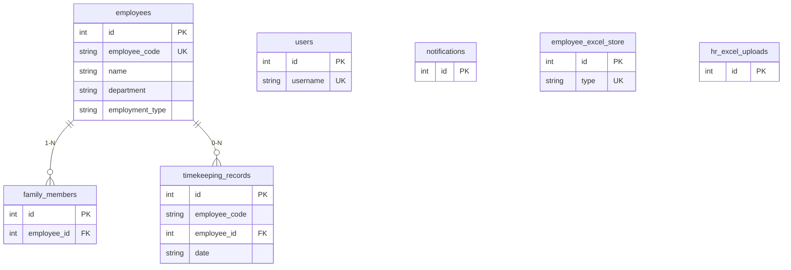

# SQL Server – Cài đặt database StaffTime Dashboard

## Sơ đồ quan hệ (ERD)



## 0. Bật đăng nhập SQL (Mixed Mode) + tạo login `ysv` (nếu chưa có)

1. SSMS → chuột phải server → **Properties** → **Security** → bật **SQL Server and Windows Authentication mode** → OK → **restart SQL Server service**.
2. Security → Logins → **New Login**:
   - Login name: `ysv`
   - SQL Server authentication, Password: (mật khẩu của bạn)
   - Bỏ **Enforce password policy** nếu chỉ dùng dev
3. **Server Roles**: có thể tick `dbcreator` để user tự tạo DB, hoặc dùng `sa` tạo DB rồi cấp quyền cho `ysv` trên DB `StaffTime`:
   ```sql
   USE StaffTime;
   CREATE USER ysv FOR LOGIN ysv;
   ALTER ROLE db_owner ADD MEMBER ysv;
   ```

## 1. Tạo database

Đăng nhập SSMS bằng `ysv` hoặc Windows/sa, chạy:

```sql
CREATE DATABASE StaffTime;
GO
```

Nếu login `ysv` không có quyền `dbcreator`, dùng tài khoản admin tạo DB rồi gán quyền như bước 0.

## 2. Chuỗi kết nối (`.env`)

Sao chép `.env.example` → `.env` và chỉnh `DATABASE_URL`:

| Tham số | Ví dụ |
|---------|--------|
| Server | `localhost` hoặc `192.168.x.x` |
| Port | `1433` (mặc định) |
| Database | `StaffTime` |
| User | `sa` hoặc user SQL bạn tạo |
| Password | mật khẩu |

**Mẫu:**

```env
DATABASE_URL="sqlserver://localhost:1433;database=StaffTime;user=sa;password=YourStrongPassword;encrypt=true;trustServerCertificate=true"
```

- Máy dev nội bộ: `trustServerCertificate=true` thường cần để tránh lỗi chứng chỉ TLS.
- Production: cấu hình `encrypt` + chứng chỉ phù hợp.

## 3. Tạo bảng (không dùng Prisma)

Mở file **`backend/prisma/migrations/20260303000000_init_sqlserver/migration.sql`** trong SSMS, chọn database `StaffTime`, **Execute**.

Hoặc copy nội dung file đó và chạy trên SQL Server.

## 4. Tạo user đăng nhập admin

```bash
npm run create:user
```

## 5. Cấu trúc bảng (tóm tắt)

| Bảng | Mô tả |
|------|--------|
| `employees` | Nhân viên |
| `family_members` | Thành viên gia đình (FK → employees) |
| `timekeeping_records` | Bản ghi chấm công |
| `users` | Tài khoản đăng nhập |
| `notifications` | Thông báo |
| `employee_excel_store` | Cache Excel nhân viên (JSON lớn) |
| `hr_excel_uploads` | Metadata upload HR |

Dữ liệu chạy thẳng trên SQL Server; không còn file SQLite `dev.db`.

## 6. Script SQL thuần (tùy chọn)

File migration đầy đủ nằm tại:

`prisma/migrations/20260303000000_init_sqlserver/migration.sql`

Chạy trực tiếp trong SSMS (không cần công cụ ORM).
