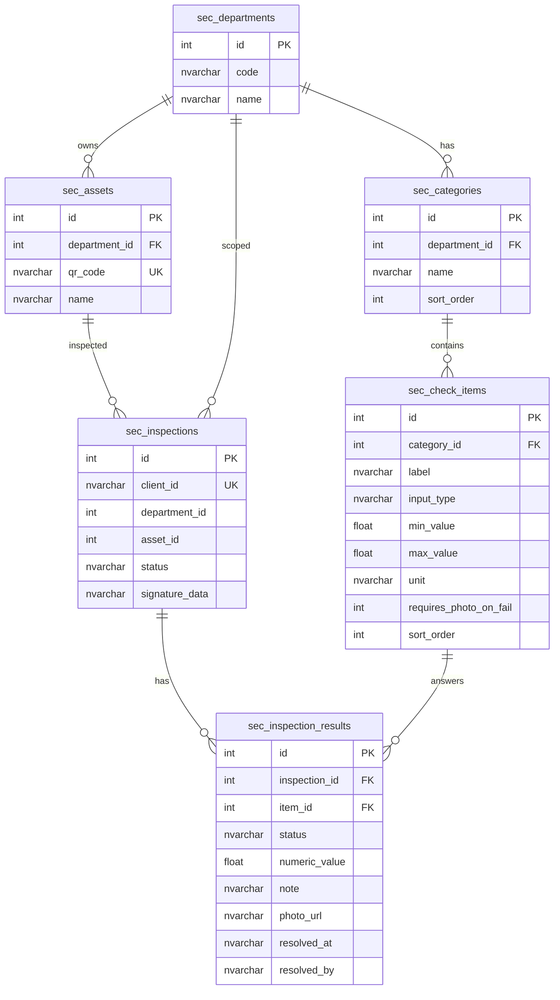

# Ánh xạ SQL Server ↔ Node.js API ↔ Tablet JSON

Tài liệu này đối chiếu **schema đề xuất 4 trụ cột** với **schema đang chạy** trong repo `stafftime-dashboard-main` và các API tương ứng.

---

## 1. Sơ đồ quan hệ (đang triển khai)



**Lưu ý:** Một phiên kiểm tra = một dòng `sec_inspections` + nhiều `sec_inspection_results`. Ngày giờ nằm ở `sec_inspections.created_at` (không duplicate `check_date` trên từng result).

---

## 2. Bảng đối chiếu cột (đề xuất → thực tế)

### `sec_check_items`

| Đề xuất | Thực tế trong DB | Ghi chú |
|---------|------------------|---------|
| `item_id` | `id` | Cùng vai trò PK |
| `item_label` | `label` | |
| `input_type` | `input_type` | `boolean` \| `number` |
| `min_value`, `max_value`, `unit` | ✓ | Ngưỡng số |
| `is_required` | *(chưa có)* | Có thể thêm sprint sau; hiện mọi mục đều bắt buộc khi gửi |
| `display_order` | `sort_order` | Editor: `POST .../reorder` |
| — | `requires_photo_on_fail` | NOT OK → ảnh (minh bạch) |

### `sec_inspection_results`

| Đề xuất | Thực tế | Ghi chú |
|---------|---------|---------|
| `result_id` | `id` | |
| `asset_id` trực tiếp | qua `inspection_id` → `sec_inspections.asset_id` | Chuẩn hóa, tránh trùng |
| `status` OK/NOT OK/N/A | `pass` / `fail` / `skip` | API/Tablet map sang nhãn **OK** / **NOT OK** / **N/A** trên UI |
| `numeric_value` | ✓ | |
| `photo_url` | ✓ (+ `photo_data` legacy) | Upload → `/uploads/security-inspection/` |
| `notes` | `note` | |
| `resolved_at`, `resolved_by` | ✓ trên cùng bảng | Thay cho `sec_resolved_logs` riêng (đủ đóng vòng lặp) |
| `sec_resolved_logs` bảng riêng | Chưa dùng | Có thể tách sau nếu cần nhiều lần “xử lý” / audit trail |

---

## 3. API Node.js ↔ SQL (đã có)

| Nghiệp vụ | Method | Path | SQL chính |
|-----------|--------|------|-----------|
| Checklist tablet | `GET` | `/departments/:id/template` | JOIN `categories` + `check_items` |
| Checklist editor | `GET` | `/admin/checklist-editor/:deptId` | Cùng nguồn, thêm sortOrder |
| CRUD hạng mục | `POST/PATCH/DELETE` | `/admin/checklist-editor/...` | `sec_categories`, `sec_check_items` |
| Quét QR | `GET` | `/assets/resolve?qr=` | `sec_assets` + `lastInspection` |
| Lưu / gửi | `POST` | `/inspections`, `/inspections/submit` | `sec_inspections` + `results` |
| Đồng bộ offline | `POST` | `/sync` | Batch upsert theo `client_id` |
| Cảnh báo mở | `GET` | `/reports/critical-alerts` | `fail` + `resolved_at IS NULL` |
| Đóng cảnh báo | `POST` | `/reports/results/:id/resolve` | UPDATE `resolved_at`, `resolved_by` |

Code map item → JSON: `mapCheckItem()` trong `backend/src/controllers/securityInspection.ts`.

---

## 4. JSON cho Tablet (từ API thực tế)

**Request:** `GET /api/security-inspection/departments/1/template`

**Response (rút gọn):**

```json
{
  "department": { "id": 1, "code": "AN", "name": "An ninh vật lý", "color": "#2563eb" },
  "categories": [
    {
      "id": 1,
      "name": "Thiết bị an ninh",
      "items": [
        {
          "id": 12,
          "label": "Nhiệt độ bề mặt tủ điện",
          "inputType": "number",
          "minValue": 0,
          "maxValue": 80,
          "unit": "°C",
          "requiresPhotoOnFail": true
        },
        {
          "id": 10,
          "label": "Camera hoạt động bình thường",
          "inputType": "boolean",
          "requiresPhotoOnFail": true
        }
      ]
    }
  ]
}
```

**Dạng phẳng (tương đương đề xuất của bạn)** — có thể derive ở Frontend:

```json
{
  "department": "An ninh vật lý",
  "items": [
    {
      "id": 12,
      "label": "Nhiệt độ bề mặt tủ điện",
      "type": "number",
      "threshold": { "min": 0, "max": 80, "unit": "°C" }
    },
    {
      "id": 10,
      "label": "Camera hoạt động bình thường",
      "type": "boolean"
    }
  ]
}
```

Editor xuất file: nút **JSON** trên `/security/admin/checklist-editor` (cấu trúc đầy đủ có `categories`).

---

## 5. Truy vấn mẫu (SQL Server)

**Máy lỗi nhiều nhất (NOT OK):**

```sql
SELECT a.qr_code, a.name, COUNT(*) AS fail_count
FROM dbo.sec_inspection_results r
INNER JOIN dbo.sec_inspections i ON i.id = r.inspection_id
INNER JOIN dbo.sec_assets a ON a.id = i.asset_id
WHERE r.status = N'fail' AND i.status = N'submitted'
GROUP BY a.qr_code, a.name
ORDER BY fail_count DESC;
```

**Báo cáo riêng bộ phận An ninh:**

```sql
SELECT d.name, ci.label, r.note, r.numeric_value, r.photo_url, i.created_at
FROM dbo.sec_inspection_results r
INNER JOIN dbo.sec_inspections i ON i.id = r.inspection_id
INNER JOIN dbo.sec_departments d ON d.id = i.department_id
INNER JOIN dbo.sec_check_items ci ON ci.id = r.item_id
WHERE d.code = N'AN' AND r.status = N'fail' AND i.status = N'submitted'
ORDER BY i.created_at DESC;
```

**Cảnh báo chưa đóng:**

```sql
SELECT r.id, ci.label, a.name, r.note, r.photo_url
FROM dbo.sec_inspection_results r
INNER JOIN dbo.sec_inspections i ON i.id = r.inspection_id
INNER JOIN dbo.sec_assets a ON a.id = i.asset_id
INNER JOIN dbo.sec_check_items ci ON ci.id = r.item_id
WHERE r.status = N'fail' AND r.resolved_at IS NULL AND i.status = N'submitted';
```

---

## 6. Khác biệt cần lộ trình (nếu muốn đúng 100% đề xuất)

| Yêu cầu | Hiện trạng | Hướng mở rộng |
|---------|------------|----------------|
| **Một máy — nhiều bộ phận checklist** | `sec_assets.department_id` = 1 bộ phận | Bảng `sec_asset_department_checklists (asset_id, department_id)` + tab trên tablet |
| `is_required` từng câu | Chưa có cột | `ALTER TABLE` + Editor checkbox |
| `sec_resolved_logs` audit | Chỉ 1 lần resolve/result | Bảng log nếu cần lịch sử nhiều lần xử lý |
| Status DB = `OK`/`NOT OK` | DB `pass`/`fail`/`skip` | Giữ DB (ổn định); map nhãn ở API/UI |

---

## 7. Kết luận

**Đã mapping đầy đủ** schema lõi (departments → categories → items → inspections → results) vào Express + React Tablet + Checklist Editor. Bạn **không cần** đoạn mẫu Node riêng trừ khi muốn endpoint `?format=flat` — logic hiện tại đã nằm trong `getDepartmentTemplate` và `mapCheckItem`.

Tham chiếu thêm: `docs/checklist-editor-schema.json`, `docs/CHECKSHEET-4-TRU-COT.md`.
